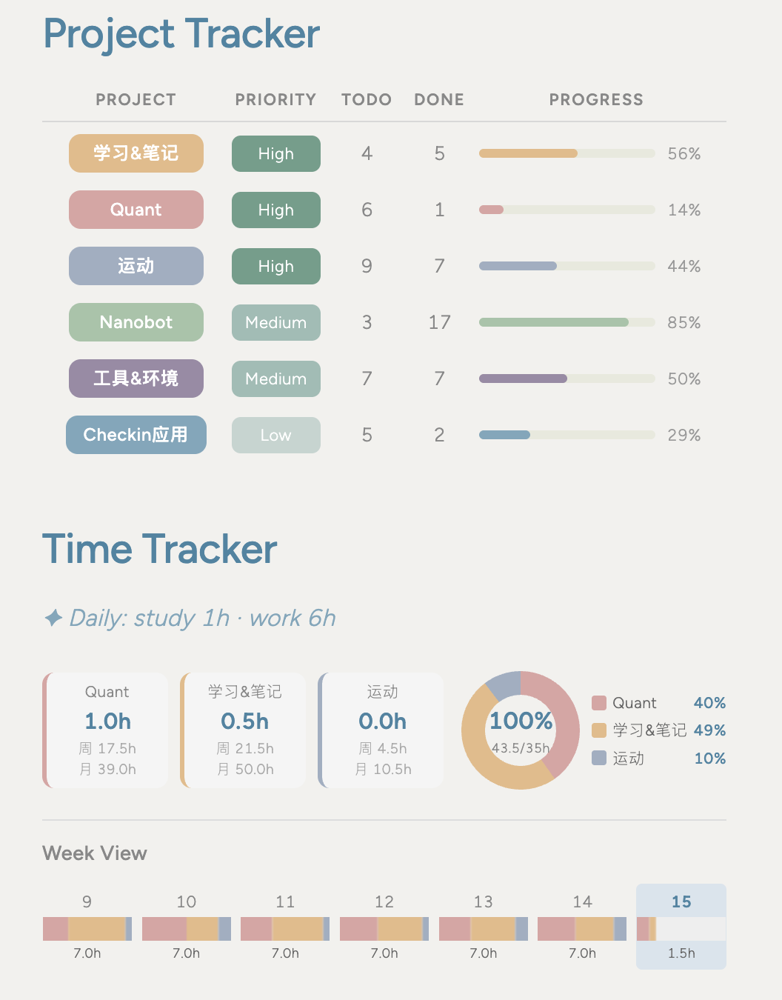
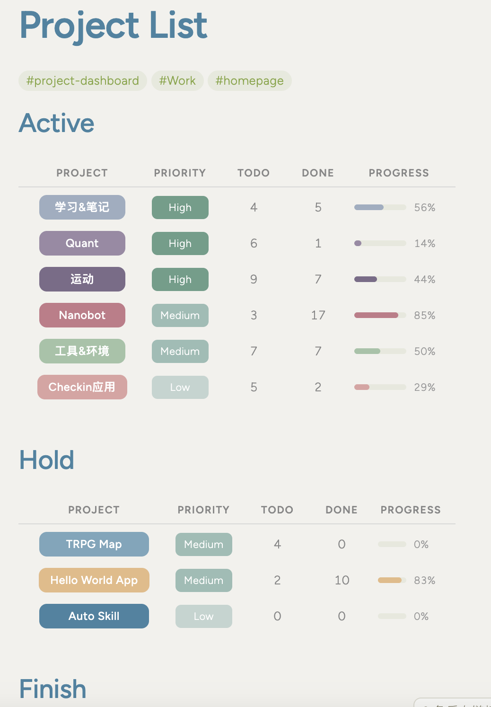

## Summary
* 逻辑：
  * Project Tracker模块：只显示active的项目。每个项目利用模板一键生成单独文件，里面管理这个项目的todo，进度条会根据todo /done的数目自动计算
  * Time Tracker模块：只显示active & high 的项目。点一下自动计时+0.5h，生成每周/每月的环形图、时间条。
  * Project List模块：显示所有的项目 

 

## Setup
### 1. check依赖插件

确保 Obsidian 已安装以下插件：
- **Dataview** - 必要，启用并开启 JavaScript 查询支持
- **Templater** - 推荐，用于通过模板创建项目
- **Completed Task** - 推荐，可以让todo list里做完的任务自动沉底

### 2. 复制文件

将以下文件复制到你的 Obsidian Vault：

```
你的Vault/
├── Resources/
│   └── Templates/
│       └── Project Template.md     # 项目模板，注意这个文件应该放在你的templater插件指定的文件夹里
├── Projects/
│   ├── Project List.md            # 项目列表
│   └── Worklog.md         # 时间追踪看板
└──
```
时间记录文件默认是：time-records-YYYYMM.md，首次运行会自动创建


### 3. 使用模版创建项目

1. 在 `Projects/` 文件夹创建新笔记
2. command + P插入模版，选择 `Project Template.md` 
3. 填写项目信息，主要是名称，tag，优先级（high/medium/low），状态（active/hold/finish），以及一些相关todo 
```
### 4. 自定义配置

 `Worklog.md` 中的 CONFIG，可以支持定义月视图/周视图，每天工作多久，点击一次增加多久计时

```javascript
const CONFIG = {
  recordFile: `time-records-${moment().format('YYYYMM')}.md`,
  DAILY_HOURS: 7,        // 每日工作时长
  quickAddHours: 0.5,   // 点击一次增加的小时数
  viewType: "week",     // week 或 month
};
```

## 常见问题

**Q: 时间记录文件不存在？**
A: 首次点击项目卡片时会自动创建 `time-records-YYYYMM.md`

**Q: 项目不显示在看板中？**
A: 检查三点：1) status 为 active，2) priority 为 high，3) 包含 #project-info 标签

**Q: 如何修改项目颜色？**
A: 在 `Worklog.md` 中修改 `projColors` 数组。Project Tracker和 Time Tracker的projColors数组最好保持一致，这样上下两个模块同一个项目的颜色才会一致。


